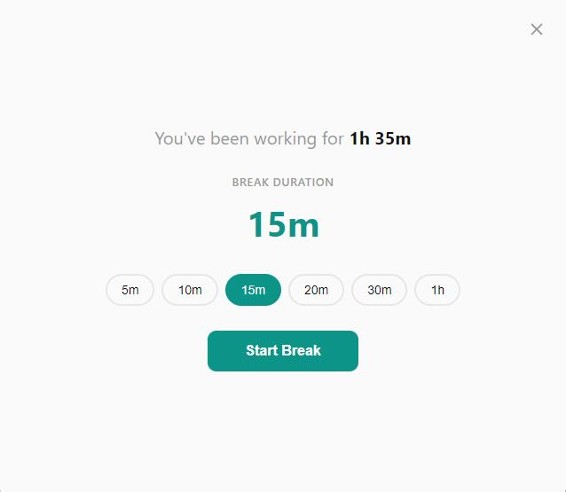
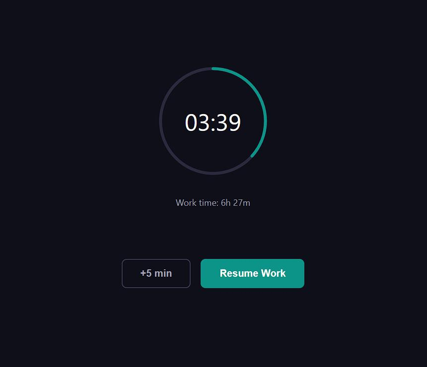
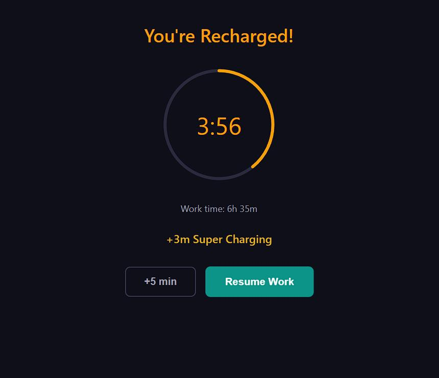
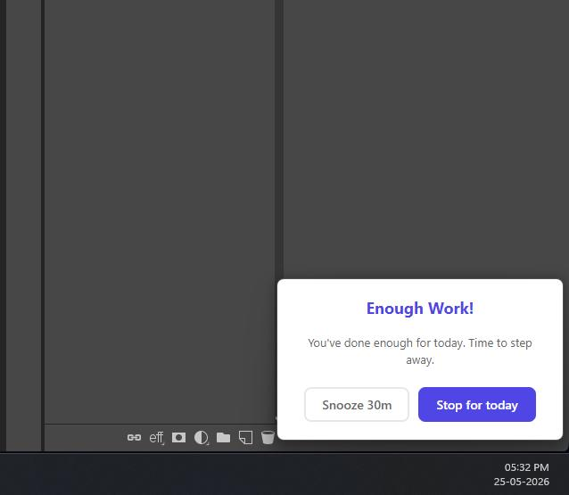

# EnoughWork

**Set a daily screen time limit. Get a fullscreen overlay when you've had enough.**

EnoughWork is a daily limit enforcer — when you've been at the screen for 8 hours (or whatever you set), it covers all your monitors and tells you to stop. Simple.

Built with [Tauri](https://tauri.app/) (Rust + webview). Not Electron.

## Why this exists

Most screen time apps remind you to take breaks every X minutes. That's not the problem. The problem is looking up at 6 PM and realizing you've been at it for 10 hours straight.

EnoughWork answers one question: **"Have I worked enough today?"** When the answer is yes, it makes you stop — fullscreen overlay on every monitor, hard to ignore. You can snooze or dismiss it, but you have to make that choice consciously.

## Philosophy

EnoughWork isn't meant to lock you down. It's a nudge to help you notice how long you've been at the screen, step away, and spend time on things that matter — rest, movement, family, hobbies. The overlay is easy to dismiss because the goal is awareness, not restriction. Better screen habits lead to better wellbeing.

## Features

- **Daily screen time tracking** — counts seconds while the screen is active, pauses during sleep/hibernate
- **Configurable limit** — set your daily limit in hours and minutes (default: 8h)
- **Fullscreen alert overlay** — appears on all monitors when limit is reached, stays on top of everything
- **Breaks** — take breaks with a circular countdown overlay, smart duration suggestion, extend/resume controls, and supercharging mode for extra rest
- **Snooze** — extend working time in 30-minute increments (cumulative)
- **Stop for today** — stop tracking entirely until the next day, with a resume option
- **Quiet mode** — mini notification popup instead of fullscreen overlay (useful during meetings)
- **Activity heatmap** — 30-day colored grid showing daily work and break totals
- **Progress bar** — shows work progress with break segments at correct positions
- **Auto-check update** — checks for new versions on startup and every 4 hours, badge notification when available
- **Fullscreen app detection** — adapts overlay behavior when games or presentations are running
- **Star Drop animation** — subtle animated notification for fullscreen apps
- **Multi-monitor support** — overlays appear on all connected monitors
- **System tray** — minimizes to tray on close, tray icon with show/quit menu
- **Auto-start on boot** — launches automatically when Windows starts
- **Single instance** — prevents duplicate windows, focuses existing one
- **Persistent state** — saves progress to disk every 60 seconds, survives app restarts
- **Daily reset** — timer resets at configurable time (default: midnight)

See [docs/features.md](docs/features.md) for detailed feature documentation and behavior.

## Screenshots

<p align="center">
  
  &nbsp;&nbsp;
  
  &nbsp;&nbsp;
  
</p>
<p align="center">
  
  &nbsp;&nbsp;
  
</p>
<p align="center">
  
  &nbsp;&nbsp;
  
</p>

## Tech stack

- [Tauri](https://tauri.app/) (Rust backend + webview frontend)
- Vanilla HTML, CSS, JavaScript (no framework)
- Plugins: autostart, single-instance, store, tray-icon, updater

## Getting started

```bash
pnpm install
pnpm dev
```

## Build for production

Requires signing keys for auto-update. Copy `.env.example` to `.env` and set the password:

```
TAURI_SIGNING_PRIVATE_KEY_PASSWORD=your_password
```

The key file should be at `keys/enoughwork.key` (generate with `pnpm signer`).

```bash
pnpm build
```

Output binaries will be in `src-tauri/target/release/bundle/`.

## Releasing

Uses [cargo-release](https://github.com/crate-ci/cargo-release) to bump versions in one step.

```bash
pnpm release:patch   # 0.1.0 → 0.2.0
pnpm release:minor   # 0.1.0 → 1.0.0
pnpm release:major   # 1.0.0 → 2.0.0
```

This will:
- Bump version in `Cargo.toml`, `package.json`, and `tauri.conf.json`
- Replace `[Unreleased]` in `CHANGELOG.md` with the version and date, and add a fresh `[Unreleased]` section
- Commit, tag (`v0.2.0`), and create a GitHub release via the publish workflow

## Project structure

```
src/
  main.js              # Main window logic + settings + heatmap + overlays
  styles.css           # All styles
  window-utils.js      # Multi-monitor DPI-aware positioning
  overlay.html/js      # Fullscreen limit-reached overlay
  break-countdown.html/js  # Break countdown overlay with ring
  notify.html          # Quiet mode notification popup
  animation.html       # Star Drop animation
src-tauri/src/
  lib.rs               # App setup, tray, plugins, window management
  commands.rs          # Tauri commands + background timer + state + settings
  main.rs              # Binary entry point
docs/
  features.md          # Detailed feature documentation
  planning/            # Feature planning docs
```
