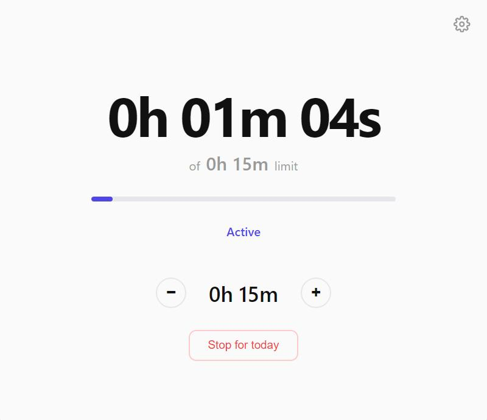
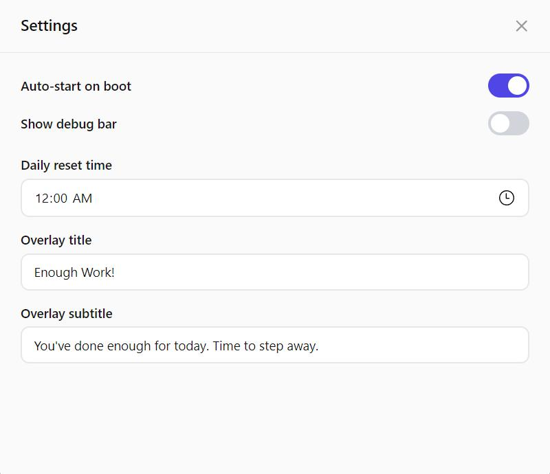
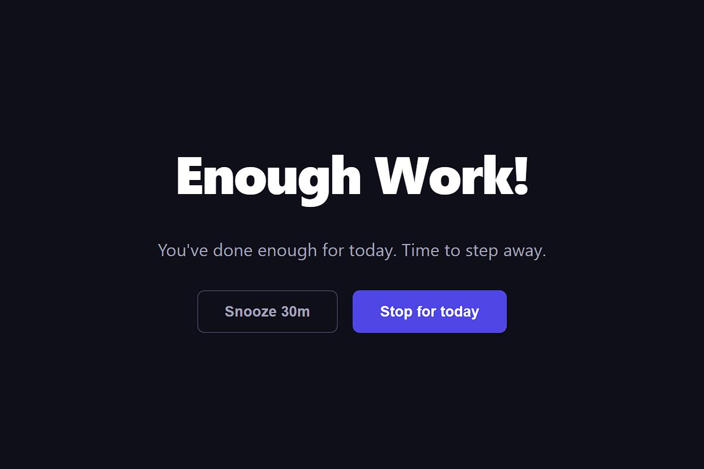

# EnoughWork

A desktop app to set a daily screen time limit, track active screen time, and alert when the limit is reached. Built with [Tauri](https://tauri.app/) + vanilla HTML/CSS/JS.

## What it does

Tracks the time your screen is active during the day. When you hit your configured limit, a fullscreen overlay appears with two options — snooze or stop for the day. The app runs in the background via system tray and starts automatically on boot.

## Philosophy

EnoughWork isn't meant to lock you down. It's a gentle nudge to help you notice how long you've been at the screen, step away, and spend time on things that matter — rest, movement, family, hobbies. The overlay is easy to dismiss because the goal is awareness, not restriction. Better screen habits lead to better wellbeing.

## Features

- **Daily screen time tracking** — counts seconds while the screen is active, pauses during sleep/hibernate
- **Configurable limit** — set your daily limit in hours (default: 8h)
- **Fullscreen alert overlay** — appears when limit is reached, stays on top of everything
- **Snooze** — dismiss the alert for 30 minutes, reappears when snooze expires (can extend by snoozing again)
- **Stop for today** — stop tracking entirely until the next day, with a resume option
- **System tray** — minimizes to tray on close, tray icon with show/quit menu
- **Auto-start on boot** — launches automatically when Windows starts
- **Single instance** — prevents duplicate windows, focuses existing one
- **Persistent state** — saves progress to disk, survives app restarts
- **Daily reset** — timer resets at configurable time (default: midnight)

## Screenshots

<p align="center">
  
  &nbsp;&nbsp;
  
</p>
<p align="center">
  
</p>

## Tech stack

- [Tauri](https://tauri.app/) (Rust backend + webview frontend)
- Vanilla HTML, CSS, JavaScript (no framework)
- Plugins: autostart, single-instance, store, tray-icon

## Getting started

```bash
pnpm install
pnpm dev
```

## Build for production

```bash
pnpm build
```

Output binaries will be in `src-tauri/target/release/bundle/`.

## Project structure

```
src/
  index.html        # Main window UI
  main.js           # Main window logic + settings
  overlay.html      # Fullscreen limit-reached overlay
  overlay.js        # Overlay logic (snooze/stop)
  styles.css        # Shared styles
src-tauri/src/
  lib.rs            # App setup, tray, plugins, window management
  commands.rs       # Tauri commands + background timer + settings
  main.rs           # Binary entry point
```
